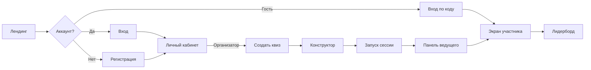

# Дизайн VK Quiz — wireframes и макеты

## Ссылки на макеты

| Ресурс | Ссылка |
|--------|--------|
| Figma (hi-fi) | https://www.figma.com/design/87S1sP6C7WkkNEHOze24bQ/Vkvize?node-id=3-55 |
| Miro (user flow) | https://miro.com/app/board/PLACEHOLDER |

> Miro: замените PLACEHOLDER после публикации user flow.

## User Flow

## Экраны (wireframes)

### 1. Лендинг `/`
- Шапка: логотип VK Quiz, кнопки «Войти» / «Регистрация»
- Hero: заголовок, CTA «Создать квиз» / «Присоединиться»
- Блок преимуществ (3 карточки)

### 2. Конструктор квиза `/organizer/quizzes/[id]/edit`
- Левая колонка: список вопросов (drag-and-drop)
- Центр: форма редактирования выбранного вопроса
- Правая колонка: настройки квиза (категории, таймер по умолчанию)

### 3. Панель ведущего `/organizer/session/[roomCode]`
- Код комнаты + QR
- Список подключённых участников
- Кнопки: «Показать вопрос», «Закрыть ответы», «Следующий», «Завершить»

### 4. Экран участника `/play/[roomCode]`
- Состояние lobby: ожидание старта
- Состояние вопроса: текст/изображение, варианты, таймер
- Состояние результата: правильный ответ, набранные баллы

### 5. Лидерборд `/play/[roomCode]/results`
- Подиум топ-3
- Таблица всех участников с баллами

## Design Tokens

Экспортированы в [`apps/web/src/styles/vk-theme.css`](../apps/web/src/styles/vk-theme.css).
